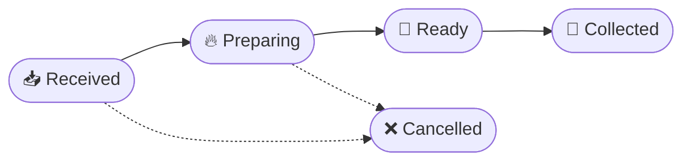
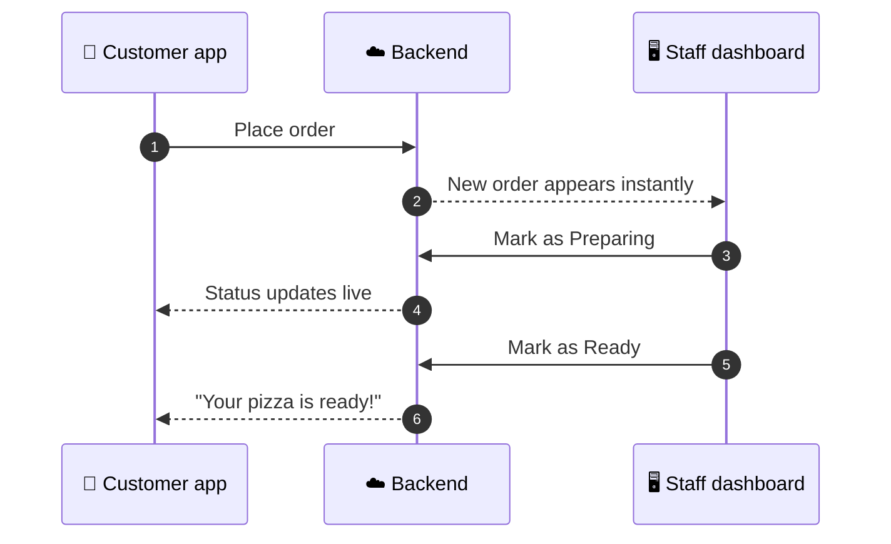

<div align="center">


# BigFresh

**Fresh pizza. Zero missed orders.**

The official ordering app for BigFresh, Marburg: order in a few taps, collect loyalty rewards, and watch your pizza go from *Received* to *Ready* in real time.

<br />


<br />

[Features](#-features) · [How it works](#-how-it-works) · [Menu](#-the-menu) · [Tech stack](#-tech-stack) · [Getting started](#-getting-started)

</div>

---

## 🍕 About

BigFresh is a locally loved pizza spot on the South Coast, nominated for **Best Pizza on the South Coast**. The pizza was never the problem. Ordering was: WhatsApp messages get buried, orders get missed, and customers turn up to a pizza that hasn't been started.

This app replaces the chat thread with one clear, reliable flow. A customer places an order, the kitchen sees it instantly, and everyone knows where it stands.

<!-- Add screenshots here once ready, e.g.:
<div align="center">
  
  
  
</div>
-->

## ✨ Features

### For customers

| | Feature | Details |
|---|---|---|
| 📱 | **Native Android app** | A real installable app with its own icon, built on Tauri rather than a mobile website. |
| 🛒 | **In-app ordering** | Browse the catalogue, build a cart and submit your order without leaving the app. |
| 🎟️ | **Digital loyalty card** | A barcode-based card tied to your account. No paper cards to lose. |
| 🔐 | **Google Sign-In** | Sign in once and your loyalty card and order history follow you across devices. |
| ⏱️ | **Live order status** | Your order updates in real time as the kitchen works on it. |
| 💬 | **WhatsApp fallback** | If an order can't reach the server, the app tells you straight away and offers WhatsApp instead. Nothing vanishes silently. |
| 🌗 | **Light and dark themes** | Animated boot sequence and smooth native-feeling transitions throughout. |

### For staff

| | Feature | Details |
|---|---|---|
| 🖥️ | **Staff order dashboard** | A password-protected site showing every order as it arrives, in real time. |
| 👥 | **Independent staff logins** | Dedicated accounts for as many team members as needed. |
| ✅ | **One-tap status workflow** | Move orders through the stages below with a single tap. |



## 🔄 How it works



## 📋 The menu

| Pizza | Medium | Large |
|---|:---:|:---:|
| Three Cheese | R65 | R90 |
| Chicken | R65 | R90 |
| Chicken & Mushroom | R65 | R90 |
| Meaty Pizza | R65 | R90 |
| Veggie Delight | R65 | R90 |
| Pepperoni | R65 | R90 |
| Salami | R65 | R90 |

> ⏰ Allow **30 to 35 minutes** preparation time. Prices and specials are managed in the app catalogue and may change.

## 🧰 Tech stack

- **[Tauri](https://tauri.app/)** for the native Android shell
- **HTML, CSS and JavaScript** in a lightweight single-page architecture
- **[Vite](https://vitejs.dev/)** for bundling
- **Google Sign-In** and cloud accounts for customer identity
- **Real-time backend** powering live order updates and the staff dashboard

## 🚀 Getting started

### Prerequisites

- [Node.js](https://nodejs.org/) 18 or newer
- [Rust](https://www.rust-lang.org/tools/install)
- [Android Studio](https://developer.android.com/studio) with the SDK and NDK installed (for Android builds)

### Run locally

```bash
# Clone the repository
git clone https://github.com/Abscissa24/BigFresh.git
cd BigFresh

# Install dependencies
npm install

# Start the dev server
npm run dev
```

### Build for Android

```bash
npm run tauri android build
```

The generated APK is written to the Tauri Android build output directory.

## 🗂️ Repository

```
BigFresh/
├── Assets/
│   └── Media/        # Logo and branding assets
├── index.html        # The app: markup, styles and logic
└── ...               # Tauri and Vite configuration
```

## 🤝 Contact

Questions, feedback or a bug to report? Open an [issue](https://github.com/Abscissa24/BigFresh/issues).

<div align="center">

<br />

Made with 🍕 and care for **BigFresh**, Marburg.

</div>
